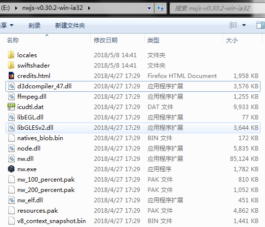
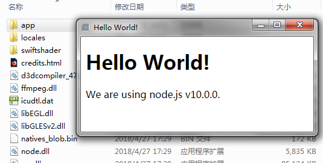
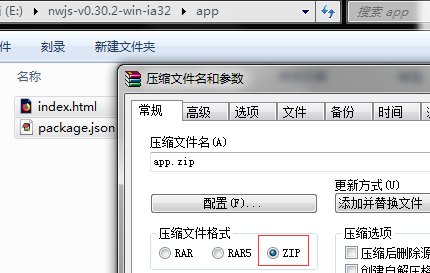
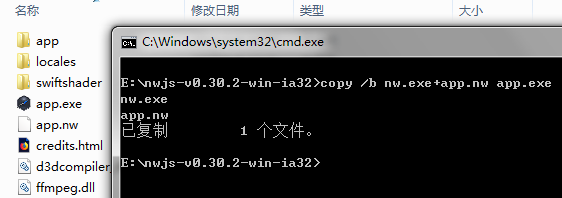
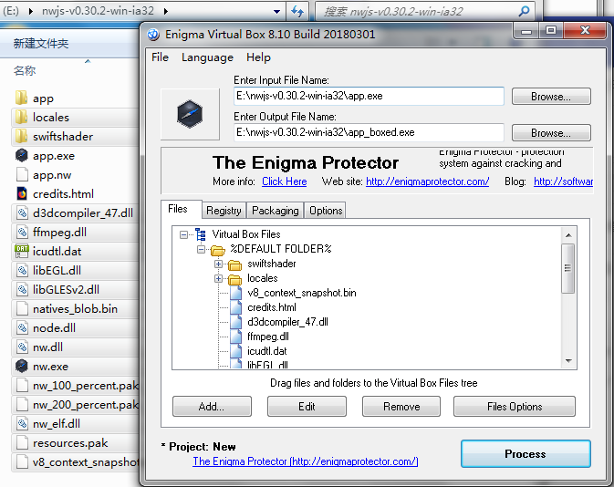
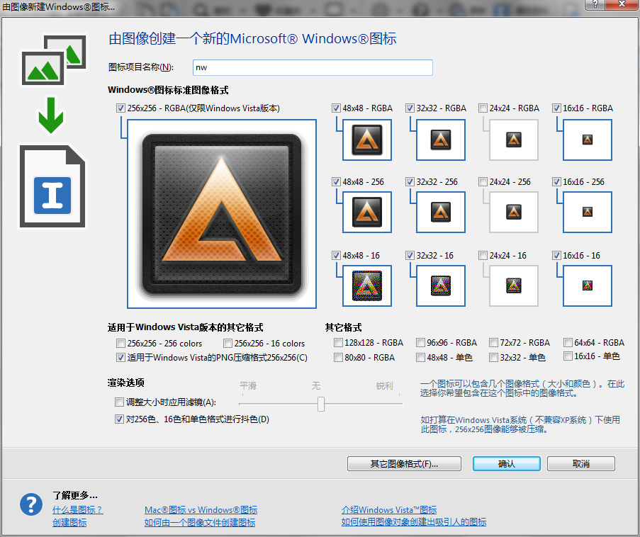
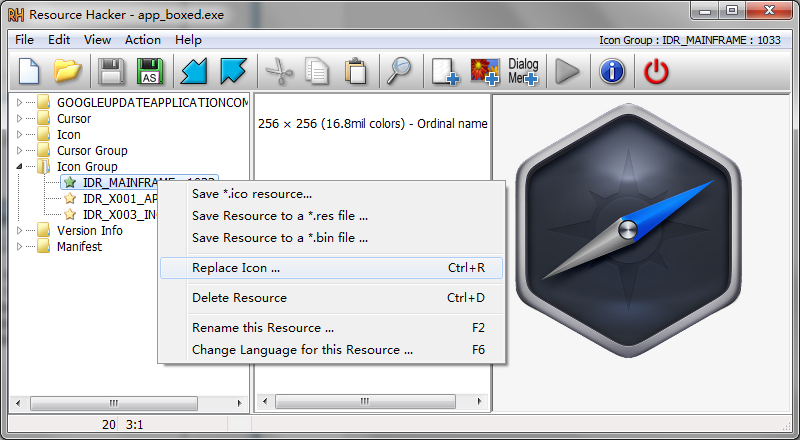

# NWjs学习<sup>shine</sup>

### NWjs简介

nwjs是在英特尔开源技术中心创建的，它是基于谷歌浏览器核心引擎和nodejs运行，你可以通过nwjs技术使用html和js语言编写本地应用程序，它也可以让你直接从DOM调用nodejs模块，使用一种新的方式与所有的Web技术编写本地应用。它主要有以下6个特点：

- （1）以网络最流行的技术编写原生应用程序的新方法
- （2）基于HTML5, CSS3, JS and WebGL而编写
- （3）完全支持nodejs所有api及第三方模块
- （4）可以使用DOM直接调用nodejs模块
- （5）容易打包和分发
- （6）支持运行环境包括32位和64位的Window、Linux和Mac OS

> 扩展：类似的框架还有[Electron](https://github.com/atom/electron "Electron github")和`Hex`。不过`Hex`已经没落，`Electron`比较火热。

### 下载安装

官方网站：[https://nwjs.io](https://nwjs.io/ "NWjs官方网站")<br/>
官方文档：[http://docs.nwjs.io](http://docs.nwjs.io/ "NWjs官方文档")

* **v0.30.2:** (Apr 28, 2018, based off of Node.js v10.0.0, Chromium 66.0.3359.139): [release notes](https://nwjs.io/blog/v0.30.2/)  
 **NOTE** You might want the **SDK build**. Please read the release notes.
 * Linux: [32bit](https://dl.nwjs.io/v0.30.2/nwjs-v0.30.2-linux-ia32.tar.gz) / [64bit](https://dl.nwjs.io/v0.30.2/nwjs-v0.30.2-linux-x64.tar.gz)
 * Windows: [32bit](https://dl.nwjs.io/v0.30.2/nwjs-v0.30.2-win-ia32.zip) / [64bit](https://dl.nwjs.io/v0.30.2/nwjs-v0.30.2-win-x64.zip)
 * Mac 10.10+: [64bit](https://dl.nwjs.io/v0.30.2/nwjs-v0.30.2-osx-x64.zip)
 * Use [Legacy build](http://nwjs.io/downloads/) for Win XP and early OSX.

请各自选择相应版本。本人开始使用的是win64，直到打包后发现不能运行，经查是[nw.js的一个坑](https://www.zhihu.com/question/39727034 "nw.js版本是64位的打包exe在win10下和xp下执行不了")，所以换32位就好了！

	>另360杀毒软件会报病毒，请添加信任或关闭杀毒软件。我是简单卸载了。



### 编写项目

我们就地新建一个`app`文件夹，并在里面新建`package.json`文件
```
{
  "name": "nw-app",
  "version": "0.0.1",
  "main": "index.html"
}
```
并新建一个`index.html`文件
```
<!DOCTYPE html>
<html>
  <head>
    <title>Hello World!</title>
  </head>
  <body>
    <h1>Hello World!</h1>
    We are using node.js <script>document.write(process.version)</script>.
  </body>
</html>
```

### 运行项目

直接把`app`文件夹拖到`nw.exe`上即可运行。或者管理员身份执行`cmd`命令：

```
$ nw app
```



### 打包发布

至此`NWjs`项目就可以预览了，但如果想发给别人就还必须打包生成执行文件。

- 首先进入`app`文件夹选择所有文件打包成`app.zip`(特别强调是zip,不是rar)

- 然后重命名为`app.nw`再剪切到父级目录里。
- 然后执行`CMD`命令:
```
copy /b nw.exe+app.nw app.exe
```


然后就可以直接运行`app.exe`文件了。但是不能复制到其他目录下运行，我们需要借助`Enigma Virtual Box`打成独立的可执行的exe文件。

### 安装Enigma Virtual Box

[下载Enigma Virtual Box](http://enigmaprotector.com/assets/files/enigmavb.exe "点击下载") 载完就直接安装。

然后打开软件并切换到中文模式，首先选择“请选择待封包的主程”为我们项目中的`app.exe`，而“封包程序另存”为默认值。然后全选项目中除了`app/`,`app.exe`,`app.nw`,`credits.html`外的所有文件并拖入到`文件`框内。运行"执行封包"。


### 优化图标

首先窗体左上角的图标是可以通过`package.json`文件配置
```
  "window": {
    "icon": "ico.png",
  }
```
但生成的应用程序的图标却是默认nwjs的，无法在代码中修改。下面我们就使用两款软件来修改此图标：[Resource Hacker](http://www.angusj.com/resourcehacker/ "点击进入下载页面") 和 [Axialis IconWorkshop](http://www.iconworkshop.cn/xiazai.html "点击进入下载页面")

- 制作图标

第一步要做的是制作ico图标，在windows系统中，可以设置“大图标”，"中等图标"和“小图标”等不同尺寸，所以，**一个ico文件实际上包含多个不同尺寸的图标**。

IconWorkshop是一款收费软件，可以试用30天。
使用Axialis IconWorkshop打开你的图片，点击左上角的图标，然后就可以选择你要生成的尺寸了。



我做的时候选择了RGBA的各种尺寸图标，然后点击确定，然后保存就生成ico文件了。

- 替换exe文件的图标

下一步就是替换图标，使用Resource Hacker打开exe文件：


在`Icon Group`中右建`IDR_MAINFAME:1033`,选择`Replace Icon...`替换为上面制作的ico文件即可。替换完后另存为一下，就可以看到新图标了。

### 后记
替换图标后运行程序很可能报**“该程序不是有效的win32位应用程序”**，我们其实还有一招更好的方法：因为ico图标是继承`nw.exe`程序的，我们把`nw.exe`的图标换了不就更省事了，一劳永逸。